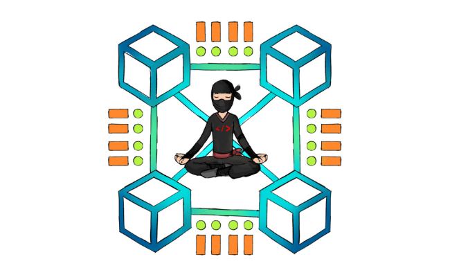

# [ Holberton School Interview Preparation Projects](https://www.holbertonschool.com/tn/en/pathways)

# 🧑🏻‍💻 Intro

This repository contains the most comon interviews algorithms that we've done at Holberton School which includes:

 - 0x00. Lockboxes [Dec 7 20...Dec 11 20] - 100.0%
 - 0x01. Insert in sorted linked list [Dec 14 20...Dec 18 20] - 100.0%
 - 0x02. Heap Insert [Dec 18 20...Dec 24 20] - 100.0%
 - 0x03. Minimum Operations [Jan 4 21...Jan 8 21] - 100.0%
 - 0x04. Sandpiles [Jan 8 21...Jan 15 21] - 95.63%
 - 0x05. Linked list palindrome [Jan 18 21...Jan 22 21] - 91.67%
 - 0x06. Log Parsing [Jan 25 21...Jan 29 21] - 100.0%
 - 0x07. Linked list cycle [Feb 1 21...Feb 5 21] - 100.0%
 - 0x08. Palindrome integer [Feb 8 21...Feb 12 21] - 100.0%
 - 0x09. UTF-8 Validation [Feb 15 21...Feb 19 21] - 100.0%
 - 0x0A. 2048 (single line) [Feb 22 21...Feb 26 21] - 0.0%
 - 0x0B. Menger sponge [Mar 1 21...Mar 5 21] - 50.0%
 - 0x0C. N Queens [Mar 15 21...Mar 19 21] - 100.0%
 - 0x0D. Array to AVL [Mar 22 21...Mar 26 21] - 100.0%
 - 0x0E. Linear search in skip list [Mar 29 21...Apr 2 21] - 0.0%
 - 0x0F. Star Wars API [Apr 2 21...Apr 8 21] - 100.0%
 - 0x10. Rain [Apr 12 21...Apr 16 21] - 100.0%
 - 0x11. Heap Sort [Apr 19 21...Apr 23 21] - 100.0%
 - 0x12. Advanced Binary Search [Apr 26 21...Apr 30 21] - 100.0%
 - 0x13. Count it! [May 3 21...May 7 21] - 85.71%
 - 0x14. Heap Extract [May 10 21...May 14 21] - 100.0%
 - 0x15. Infinite Multiplication [May 17 21...May 21 21] - 0.0%
 - 0x16. Rotate 2D Matrix [May 24 21...May 28 21] - 50.0%
 - 0x17. Find the Loop [May 31 21...Jun 4 21] - 0.0%
 - 0x18. Merge Sort [Jun 7 21...Jun 11 21] - 91.67%
 - 0x19. Making Change [Jun 21 21...Jun 25 21] - 100.0%

By [Khouloud](https://www.linkedin.com/in/khouloud-alkhammassi-3a9078129) Software engineer at [HolbertonSchool®️](https://www.holbertonschool.com)